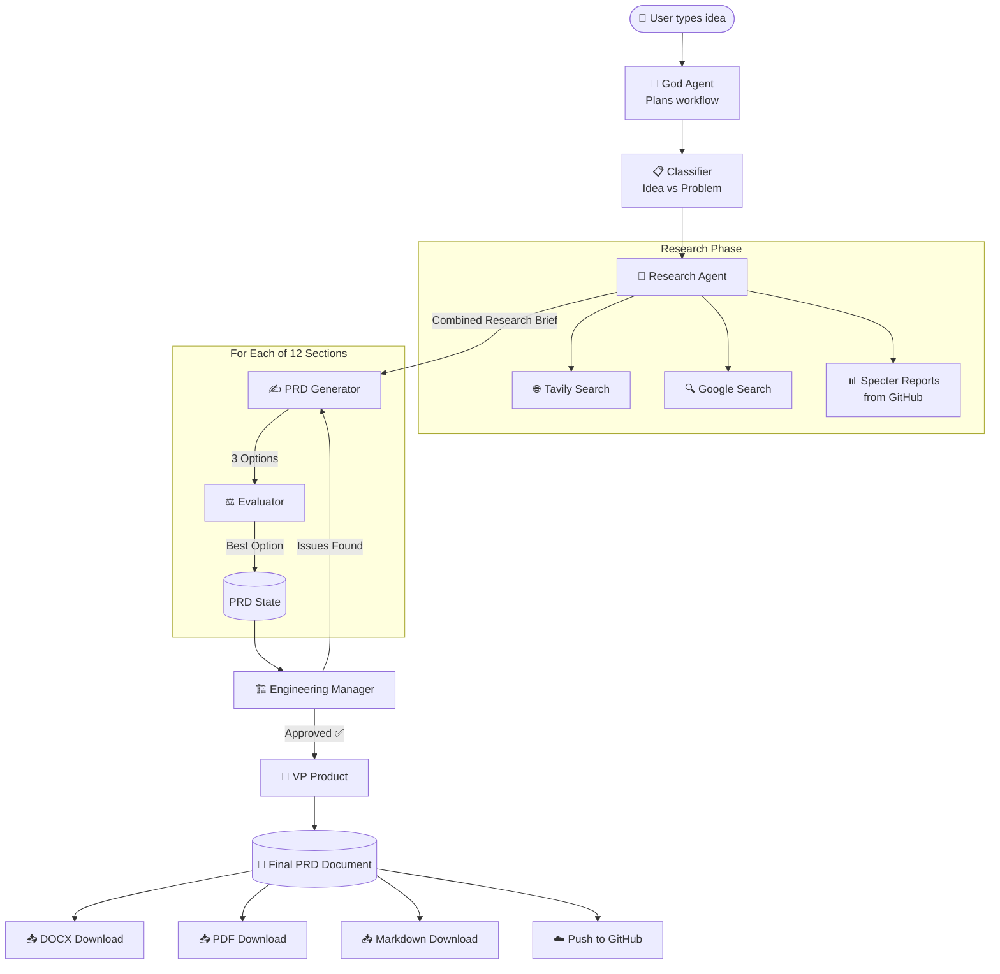
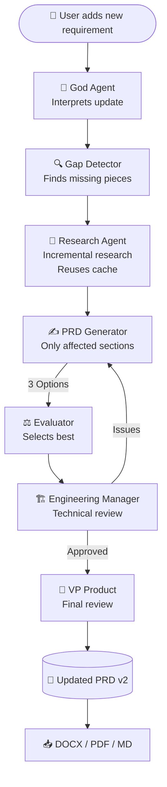
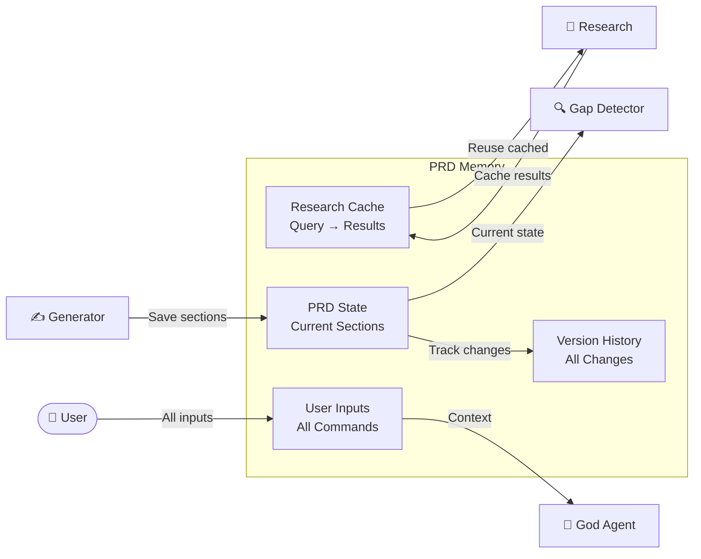
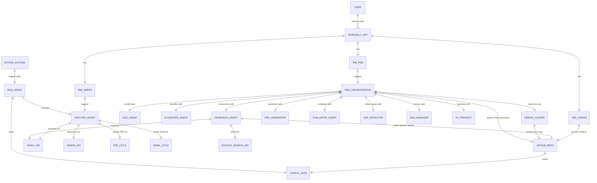

# PRD Engine — Complete Technical Deep Dive

Welcome to the complete, no-jargon documentation for the **PRD Engine** — the multi-agent AI system that generates enterprise-grade Product Requirements Documents. This guide explains everything so simply that anyone can understand it, regardless of technical or product management experience.

---

## 1. What Is This System? (Plain English)

### What is a PRD?
A **Product Requirements Document (PRD)** is a blueprint for building a product. Think of it like an architect's blueprint for a house — before construction starts, everyone needs to agree on what the house looks like, how many rooms it has, what materials to use, and how much it costs. A PRD does the same thing for software products.

### What does this system do?
Imagine you hired **7 expert product people** and told them: *"I want to build an app that helps restaurants manage their inventory."* In a normal company, those 7 people would spend weeks researching the market, writing the blueprint, reviewing each other's work, and polishing the final document.

**This system does all of that in 2-3 minutes.** It uses 7 AI "agents" (think of them as 7 virtual employees) who each specialize in a different part of the process. They communicate with each other, pass work back and forth, and produce a professional PRD document at the end.

### What does "multi-agent" mean?
Instead of one AI doing everything (which produces mediocre results), we split the work among **7 specialized AIs**. Each one is an expert at ONE thing:
- One researches the market
- One writes the document
- One checks for quality
- One reviews from an engineering perspective
- etc.

This is exactly how real product teams work — no single person does everything.

---

## 2. The 7 Agents — Who They Are

### 🎯 Agent 0: God Agent (Master Orchestrator)

**Plain English Job Title:** Head of Product + Chief of Staff + Program Manager

**What it does:**
The God Agent is the **boss** of the entire system. When you type your idea, the God Agent reads it first and decides:
- "What kind of idea is this?"
- "What research do we need?"
- "Which sections should we focus on?"
- "Is this an update to an existing PRD or a new one?"

Think of it as the project manager who assigns tasks to everyone else.

**📋 PRD (What This Agent Must Do):**
- Understand user intent from minimal input (even 2-3 sentences)
- Create a workflow plan: which agents to activate and in what order
- For updates: decide which sections need rewriting vs which can stay
- Manage the overall flow — if something fails, decide what to do next

**🔗 ERD (Who It Talks To):**
```
User Input → [GOD AGENT] → Classifier Agent
                         → Research Agent
                         → PRD Generator (assigns sections)
                         → Gap Detector (during refinement)
```

**⚙️ Model Used:** Gemini 2.0 Flash (chosen for speed — the God Agent needs to make fast decisions)

**📊 Example Output:**
```json
{
  "input_quality": "high",
  "input_summary": "Mobile inventory management app with AI forecasting",
  "research_queries": [
    "inventory management app market size 2024",
    "competitors to inventory management apps",
    "AI demand forecasting for small businesses",
    "restaurant inventory management pain points"
  ],
  "focus_areas": ["user experience", "AI/ML integration", "mobile-first design"],
  "special_instructions": "Focus on small business use case, emphasize simplicity"
}
```

---

### 📋 Agent 1: Classifier Agent

**Plain English Job Title:** Input Analyst

**What it does:**
Reads your input and answers one simple question: *"Is this an idea they want to build, a problem they want to solve, or both?"*

Why does this matter? Because an "idea" (e.g., "Build a food delivery app") needs different research than a "problem" (e.g., "Restaurants are losing 30% of ingredients to waste").

**📋 PRD:**
- Classify input as: idea, problem statement, or both
- Extract the core problem statement (even if user only gave an idea)
- Extract the core idea (even if user only described a problem)

**🔗 ERD:**
```
God Agent → [CLASSIFIER] → PRDContext object → Research Agent
                                              → PRD Generator
```

**⚙️ Model Used:** Gemini 2.0 Flash (simple classification task, speed matters)

**📊 Example Output:**
```json
{
  "input_type": "both",
  "problem_statement": "Small businesses struggle to manage inventory efficiently, leading to waste and lost revenue",
  "idea": "A mobile app with AI-powered demand forecasting for real-time inventory management"
}
```

---

### 🔬 Agent 2: Research Agent

**Plain English Job Title:** Senior Market Researcher

**What it does:**
The Research Agent is like hiring a research firm. It:
1. Searches the internet using **Tavily** (a specialized AI search engine)
2. Searches using **Google** (broad web coverage)
3. **Combines both results** and removes duplicates
4. Pulls **Specter intelligence reports** from the GitHub repository (these are daily market research reports generated by the Specter agent)
5. Synthesizes everything into a comprehensive research brief

For updates: it **reuses previous research** from memory and only searches for new topics it hasn't covered yet.

**📋 PRD:**
- Execute BOTH Tavily AND Google Search for every query
- Merge and deduplicate results by URL
- Fetch Specter reports from GitHub `reports/` folder
- Cache all results in memory for reuse
- Support incremental research (only research what's new)

**🔗 ERD:**
```
God Agent (queries) → [RESEARCH AGENT] → Tavily API
                                       → Google Custom Search API
                                       → GitHub API (Specter reports)
                                       ↓
                              Research Data → PRD Generator
                              Research Data → Memory (cached)
```

**⚙️ Model Used:** Gemini 1.5 Flash (for synthesizing research into a brief)

**📊 Example Output:**
```
Research Brief:
- Market Size: Inventory management software market is $3.2B (2024)
- Key Competitors: Sortly, inFlow, Cin7, Fishbowl
- User Pain Points: Manual counting, spreadsheet errors, no forecasting
- Technical Trends: AI/ML for demand prediction, mobile-first, cloud-based
- Specter Reports: 3 relevant reports on retail/restaurant tech trends
```

---

### ✍️ Agent 3: PRD Generator Agent

**Plain English Job Title:** Senior Product Manager & Technical Writer

**What it does:**
The workhorse of the system. For **every section** of the PRD (there are 12 sections), it writes **3 complete, detailed drafts** — each from a slightly different angle. This gives the Evaluator Agent options to choose from.

Every section starts with a **plain-English explanation** of what the section IS and why it matters, so non-PM readers can follow along.

**📋 PRD:**
- Generate 3 distinct options for each of 12 PRD sections
- Each option must be 400+ words with specific details
- Start every section with "What this section means" intro
- Incorporate research findings into the content
- If Engineering Manager sends back feedback, rewrite with improvements

**🔗 ERD:**
```
Research Summary → [PRD GENERATOR] → 3 Options per section → Evaluator
Engineering Feedback → [PRD GENERATOR] → Revised Options → Evaluator
```

**⚙️ Model Used:** Gemini 1.5 Pro (chosen for deep, detailed content generation — the most important agent needs the best model)

**The 12 PRD Sections Generated:**
1. Executive Summary
2. Problem Statement
3. Solution Overview
4. User Personas
5. User Stories & Flows
6. Functional Requirements
7. Non-Functional Requirements
8. Technical Architecture
9. Business Requirements & Monetization
10. Implementation Roadmap
11. Risks & Mitigations
12. Success Metrics & KPIs

---

### ⚖️ Agent 4: Evaluator Agent

**Plain English Job Title:** Quality Selector

**What it does:**
For each section, it reads all 3 drafts and picks the best one. It scores them on:
- **Clarity** — Can a non-PM person understand it?
- **Completeness** — Does it cover everything?
- **Specificity** — Concrete details or vague fluff?
- **Business alignment** — Does it serve the product goals?
- **Detail level** — Enough for implementation?

**📋 PRD:**
- Evaluate all 3 options for each section
- Select the best with a quality score (1-10)
- Provide rationale for the selection

**🔗 ERD:**
```
PRD Generator (3 options) → [EVALUATOR] → Best option + rationale → PRD State
```

**⚙️ Model Used:** Gemini 2.0 Flash (fast comparison task)

---

### 🔍 Agent 5: Gap Detector Agent

**Plain English Job Title:** Quality Inspector

**What it does:**
After the PRD is assembled, this agent scans the entire document looking for:
- Missing sections or topics
- Weak areas with vague language
- Incomplete logic or requirements
- Things the user asked for that aren't covered

Used primarily during **iterative refinement** — when the user adds new requirements.

**📋 PRD:**
- Analyze current PRD content against completeness standards
- Compare PRD with user's new input to find gaps
- Output structured report of missing/weak areas

**🔗 ERD:**
```
Current PRD + New User Input → [GAP DETECTOR] → GapReport → God Agent
                                                            → Research Agent (for new queries)
                                                            → PRD Generator (for rewrites)
```

**⚙️ Model Used:** Gemini 2.0 Flash (quick analysis)

**📊 Example Output:**
```json
{
  "missing_sections": ["Accessibility requirements", "Data migration plan"],
  "improvements_needed": [
    {"section": "Technical Architecture", "issue": "No database schema", "suggestion": "Add specific table designs"}
  ],
  "weak_areas": ["Success Metrics needs specific numeric targets"],
  "overall_completeness_score": 7
}
```

---

### 🏗️ Agent 6: Engineering Manager Agent

**Plain English Job Title:** Technical Expert & Gate Keeper

**What it does:**
Reviews the entire PRD from a **pure engineering perspective**. This is the "reality check" agent — it asks questions like:
- "Can this actually be built with the proposed technology?"
- "What happens when 10,000 users hit this system at once?"
- "Are there security holes?"
- "What edge cases will break things?"

If the Engineering Manager finds problems, it sends **specific feedback** back to the PRD Generator, and those sections get rewritten. This can happen up to **2 times** before the system moves on.

**📋 PRD:**
- Review PRD for: scalability, security, API gaps, edge cases, UI/UX consistency
- Grade severity of each issue: Critical / Major / Minor
- Provide actionable feedback for each affected section
- Approve or send back for revision (max 2 re-loops)

**🔗 ERD:**
```
Complete PRD → [ENGINEERING MANAGER] → Approved ✅ → VP Product
                                     → Rejected ❌ → feedback → PRD Generator → Evaluator → back to Eng Manager
```

**⚙️ Model Used:** Gemini 1.5 Flash (needs technical depth)

**📊 Example Output:**
```json
{
  "approved": false,
  "overall_score": 6,
  "issues": [
    {"section": "Technical Architecture", "severity": "critical", "issue": "No caching strategy for API calls", "recommendation": "Add Redis caching layer"}
  ],
  "feedback_for_sections": {
    "Technical Architecture": "Add caching, rate limiting, and CDN details",
    "Non-Functional Requirements": "Specify response time SLAs for each API endpoint"
  }
}
```

---

### 👔 Agent 7: VP Product Agent

**Plain English Job Title:** Vice President of Product Management

**What it does:**
The **final gate**. The VP Product reviews the complete PRD from a business and strategic perspective:
- Is the product vision clear and compelling?
- Will users actually want this?
- Is the monetization viable?
- Is the go-to-market strategy clear?
- What did everyone else miss?

Nothing ships without VP approval. The VP adds a "Missed Cases" section — critical gaps identified during executive review.

**📋 PRD:**
- Executive review of complete PRD
- Identify: strategic gaps, market fit concerns, business risks, competitive threats
- Add "Missed Cases & Critical Gaps" Q&A section
- Provide final verdict: Approved / Conditional / Needs Revision

**🔗 ERD:**
```
Complete PRD + Engineering Review → [VP PRODUCT] → Final Review + Missed Cases → DOCX Output
```

**⚙️ Model Used:** Gemini 1.5 Flash (strategic analysis)

---

## 3. Complete Flow Diagrams

### 3a. Initial PRD Generation Flow

This is what happens when you type your idea and press "Generate PRD":



### 3b. Iterative Refinement Flow

This is what happens when you use "Refine PRD" or "Add Requirement":



---

## 4. Data Structures (With Examples)

### PRDMemory — The System's Brain
Everything the system remembers across iterations:

```json
{
  "research_memory": {
    "inventory management market size": [
      {"title": "Market Report 2024", "url": "...", "snippet": "..."}
    ],
    "AI demand forecasting": [
      {"title": "ML for Retail", "url": "...", "snippet": "..."}
    ]
  },
  "prd_state": {
    "Executive Summary": {
      "title": "Executive Summary",
      "selected_option": "This product is a mobile-first...",
      "rationale": "Option 2 selected for clarity...",
      "version": 2
    }
  },
  "version": 2,
  "user_inputs": [
    "Build an inventory management app with AI",
    "Add offline mode support"
  ]
}
```

### GapReport — What's Missing
Output of the Gap Detector Agent:

```json
{
  "missing_sections": ["Data Migration Plan", "Accessibility Standards"],
  "improvements_needed": [
    {
      "section": "Technical Architecture",
      "issue": "No database schema defined",
      "suggestion": "Add PostgreSQL table definitions and relationships"
    }
  ],
  "weak_areas": ["Success Metrics needs specific numeric targets"],
  "overall_completeness_score": 7
}
```

### EngineeringReview — Technical Verdict
Output of the Engineering Manager Agent:

```json
{
  "approved": false,
  "overall_score": 6,
  "issues": [
    {
      "section": "Technical Architecture",
      "severity": "critical",
      "issue": "No caching strategy",
      "recommendation": "Add Redis for API response caching"
    }
  ],
  "feedback_for_sections": {
    "Technical Architecture": "Add caching layer, rate limiting, and CDN configuration"
  }
}
```

---

## 5. The Memory System

### Why Memory Matters
Without memory, every time you click "Refine PRD", the system would start from scratch — re-researching everything, regenerating all sections. That's wasteful and slow.

With memory, the system:
1. **Remembers all past research** — if it already searched "inventory management competitors", it won't search again
2. **Keeps the current PRD state** — knows exactly what each section says right now
3. **Tracks version history** — can show you what changed between v1 and v2
4. **Remembers all your inputs** — builds context over multiple refinements

### How Memory Flows



---

## 6. Entity Relationship Diagram (Full System)

This shows how ALL components of the entire STREAMINTEL system connect — including both the Specter research agent and the PRD Engine:



---

## 7. Model Specifications

| # | Agent | Model | Why This Model |
|---|-------|-------|---------------|
| 0 | God Agent | Gemini 2.0 Flash | Fast intent parsing — needs to make quick decisions about workflow |
| 1 | Classifier Agent | Gemini 2.0 Flash | Simple classification task — speed over depth |
| 2 | Research Agent | Gemini 1.5 Flash | Good at summarizing large amounts of search data |
| 3 | PRD Generator | Gemini 1.5 Pro | **Most important agent** — needs the best model for deep, detailed content |
| 4 | Evaluator Agent | Gemini 2.0 Flash | Quick comparison and selection — speed matters |
| 5 | Gap Detector | Gemini 2.0 Flash | Fast analysis of PRD completeness |
| 6 | Engineering Manager | Gemini 1.5 Flash | Needs technical depth for architecture review |
| 7 | VP Product | Gemini 1.5 Flash | Needs strategic thinking for business review |

**Fallback Strategy:** If a preferred model isn't available, each agent automatically falls back to `gemini-1.5-flash` to ensure the system never crashes.

---

## 8. Walk-Through Example

**What happens when you type: "Build a mobile app for real-time inventory management using AI" and press Generate PRD**

### Second 0-5: God Agent Plans
```
🎯 God Agent reads your input
→ "This is a product idea for a mobile app"
→ Plans 5 research queries about inventory management
→ Focus areas: mobile-first, AI/ML, small business UX
```

### Second 5-15: Classification + Research
```
📋 Classifier: "This is BOTH an idea AND a problem statement"
🔬 Research Agent fires:
  - Tavily: "inventory management app market size" → 5 results
  - Google: "inventory management app market size" → 5 results
  - Combined: 8 unique results (2 duplicates removed)
  - Repeats for 4 more queries = ~40 unique results
  - Fetches 3 Specter reports from GitHub
  - Synthesizes everything into a 500-word research brief
```

### Second 15-120: Section Generation (the bulk of the work)
```
For EACH of 12 sections:
  ✍️ PRD Generator writes 3 complete drafts (400+ words each)
  ⚖️ Evaluator compares and picks the best
  ⏱️ 2-second delay between sections (rate limiting)

That's 12 × 2 = 24 API calls for generation + 12 for evaluation = 36 calls
```

### Second 120-140: Engineering Review
```
🏗️ Engineering Manager reviews entire PRD
  → Finds: "No caching strategy in Technical Architecture"
  → Sends feedback to PRD Generator
  ✍️ PRD Generator rewrites Technical Architecture with caching
  ⚖️ Evaluator picks best revised version
🏗️ Engineering Manager reviews again
  → Approved ✅
```

### Second 140-160: VP Product Review + Document Generation
```
👔 VP Product reviews complete PRD
  → Adds "Missed Cases" section with 5 Q&A items
📄 Document generation:
  → DOCX saved to reports/ folder
  → Pushed to GitHub repository
  → Available for PDF and Markdown download
```

### Final Result
A comprehensive PRD document with:
- 12 detailed sections (each 400+ words)
- Engineering review summary
- VP Product executive review with missed cases
- Version metadata
- Available in DOCX, PDF, and Markdown formats

---

## 9. Error Logging System

When any error occurs (API failure, network issue, model unavailable), the system:
1. Logs the error locally to the console
2. Creates a timestamped error file (e.g., `error_research_agent_2024-04-12_14-30-45.log`)
3. Pushes it to the `error_logs/` folder in the GitHub repository
4. Continues execution with fallback behavior

This means you can always check `error_logs/` in your GitHub repo to see what went wrong and when.

---

## 10. File Structure

```
GhostAgents/
├── app.py                  ← Streamlit dashboard (3 tabs)
├── prd_engine.py           ← 7-agent PRD system (this document explains this file)
├── streamintel_agent.py    ← Specter research agent (untouched)
├── pdf_utils.py            ← PDF generation for Specter reports
├── email_utils.py          ← Email distribution
├── run_agent.py            ← Headless agent runner (GitHub Actions)
├── config.json             ← Search keywords + schedule
├── requirements.txt        ← Python dependencies
├── error_logs/             ← Auto-generated error log files
├── reports/                ← Generated PRDs and Specter reports
└── documentation/
    ├── DETAILED_FILE_BREAKDOWN.md    ← File-by-file PRD+ERD
    ├── STREAMINTEL_OVERVIEW.md       ← System overview
    └── PRD_ENGINE_DEEP_DIVE.md       ← This document
```
