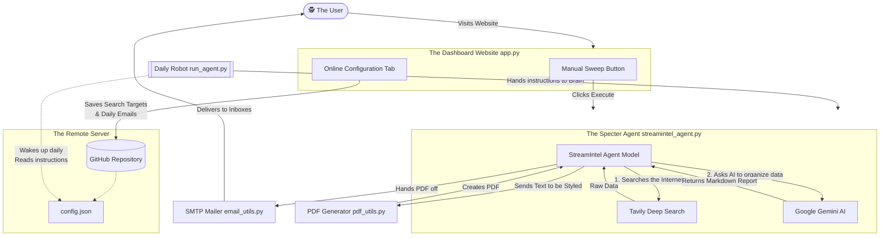
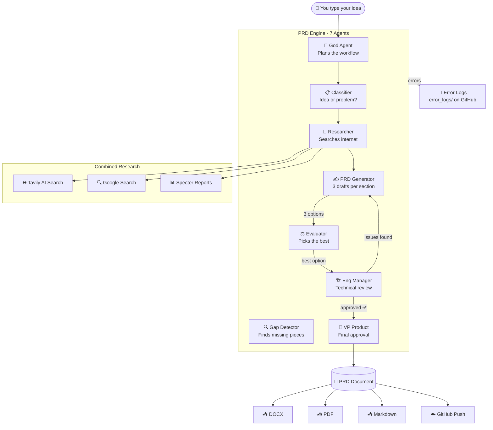

Welcome to the non-technical master document for **STREAMINTEL**! This guide is written in plain English to help anyone—regardless of coding experience—understand exactly what this software does, how it is built, and how all the different pieces talk to each other.

---

### Executive Summary
Streamintel is an autonomous "ghost agent" that behaves like a digital researcher. Every day, it wakes up, searches the internet for new trends, features, and rumors regarding live streaming platforms (like Twitch, YouTube, and Kick), compiles a beautiful PDF intelligence report, and emails it directly to the team. 

It provides an interactive website (the Dashboard) where a team manager can remotely steer the agent's focus and manually trigger research scans at any time.

### Core Goals
- **Save Time:** Completely replace the need for human analysts to endlessly scroll social media to find streaming industry updates.
- **Deep Research:** Utilize "Retrieval-Augmented" AI to go beyond surface-level answers and stitch together weak signals into a coherent strategy report.
- **Set & Forget Operations:** The system must run flawlessly in the background, forever, for free, without needing a developer to constantly manage a server.
- **Distribution:** Automatically put the final PDF report directly into the hands of stakeholders via email.

### The Two Ways to Use Streamintel
1. **The Remote Dashboard (Streamlit Cloud):** A website where you can type in new search targets (e.g., "Find out what Kick is doing with monetization"), and hit a giant "Execute" button to force a scan right now. You can also type in comma-separated emails to instantly send the results to colleagues.
2. **The Automated Robot (GitHub Actions):** A silent background process running on GitHub servers. Every day (e.g., at 8:00 AM), it wakes up, reads the instructions you saved from the Dashboard, does the research, and automatically emails the daily summary to the team's mailing list.

---

## 2. Entity Relationship & Architecture Diagram (ERD)
This diagram tracks the flow of data through our entire ecosystem. It shows how the User (you) interacts with the website, and how the website relays instructions to the invisible background robot.

---

## 3. How the "Specter" Agent Actually Works
The brain of this application lives in `streamintel_agent.py`. It uses a methodology known in the AI world as **Retrieval-Augmented Generation (RAG) with Direct Prompting**.

**Here is the plain-English translation of that process:**

1. **The Wake Up:** The agent starts by receiving a list of "Target Vectors" (your keywords).
2. **The Hunt (Retrieval):** The agent does *not* immediately ask the AI to answer the underlying question. Instead, it uses **Tavily** (a specialized search engine built for AI). It says to Tavily, "Scrape the internet for the last 7 days regarding these keywords and give me the raw, messy text."
3. **The Assembly (Augmented):** The agent takes all this messy, raw internet data and wraps it into a giant box. 
4. **The Brain (Generation):** Finally, the agent calls **Google Gemini** (the actual Artificial Intelligence). It gives Gemini the giant box of raw data and says: 
   > *"You are Specter, a covert intelligence operative. Do not make anything up. Read all the messy text in this box, stitch it together into a clean, strategic breakdown focused on engagement and monetization, stamp it with today's date, and format it perfectly."*
5. **The Output:** Gemini returns a beautifully written, perfectly categorized Markdown (text) report.

By forcing the AI to only look at the box of fresh internet data we just gathered, we prevent the AI from "hallucinating" or making things up, and guarantee it only analyzes the absolute newest information on the internet!

---

## 4. The PRD Engine — 7-Agent AI Product Team

The PRD Maker is the second major system inside STREAMINTEL. While the Specter agent handles daily market research, the PRD Engine handles **product creation** — it takes a simple idea and produces a full, professional Product Requirements Document.

### What Is a PRD?
A Product Requirements Document is the blueprint for building a product. Just like an architect's blueprint tells builders exactly what a house should look like, a PRD tells engineers exactly what software to build. It covers everything: what the product does, who it's for, how it works technically, how to make money from it, what could go wrong, and how to measure success.

### How the 7 Agents Work Together

### The 7 Agents Explained (Plain English)

| # | Agent | Role | What It Does |
|---|-------|------|-------------|
| 0 | 🎯 God Agent | Head of Product | Reads your input, decides the game plan, assigns tasks to everyone else |
| 1 | 📋 Classifier | Input Analyst | Figures out if you gave an idea, a problem, or both — shapes the approach |
| 2 | 🔬 Research Agent | Market Researcher | Searches Tavily + Google simultaneously, pulls Specter reports from GitHub |
| 3 | ✍️ PRD Generator | Product Writer | Writes 3 complete drafts for every section so the best one can be chosen |
| 4 | ⚖️ Evaluator | Quality Selector | Compares all 3 drafts and picks the strongest based on clarity and completeness |
| 5 | 🔍 Gap Detector | Quality Inspector | Scans the finished PRD for missing pieces and weak areas |
| 6 | 🏗️ Eng Manager | Technical Reviewer | Checks for scalability issues, security gaps, and edge cases. Sends sections back for rewriting if needed (max 2 times) |
| 7 | 👔 VP Product | Executive Gate | Final business & strategy review. Adds "Missed Cases" section. Nothing ships without VP approval |

### Iterative Refinement
After generating a PRD, users can click **"Refine PRD"** to add new requirements. The system:
1. Uses the **Gap Detector** to find what's missing
2. **Research Agent** only searches for NEW topics (reuses cached results)
3. Only **affected sections** get regenerated (not the entire document)
4. Engineering Manager and VP Product review the changes

This saves significant time and API costs compared to regenerating everything.

### Memory System
The PRD Engine remembers everything:
- **Research Cache** — past search results reused across iterations
- **PRD State** — current content of every section
- **Version History** — tracks all changes (v1 → v2 → v3...)
- **User Inputs** — every instruction you've given

### Error Logging
When any agent encounters an error, the system:
1. Logs it to the console
2. Creates a timestamped `.log` file
3. Pushes it to `error_logs/` on GitHub for permanent tracking

### PRD Sections Generated
1. Executive Summary
2. Problem Statement
3. Solution Overview
4. User Personas
5. User Stories & Flows
6. Functional Requirements
7. Non-Functional Requirements
8. Technical Architecture
9. Business Requirements & Monetization
10. Implementation Roadmap
11. Risks & Mitigations
12. Success Metrics & KPIs

Plus: Engineering Review Summary, VP Product Executive Review, and Change History.

### Full Technical Details
For the complete deep-dive with data structures, model specifications, flow diagrams, and step-by-step walkthrough, see:
📄 **[PRD_ENGINE_DEEP_DIVE.md](./PRD_ENGINE_DEEP_DIVE.md)**

