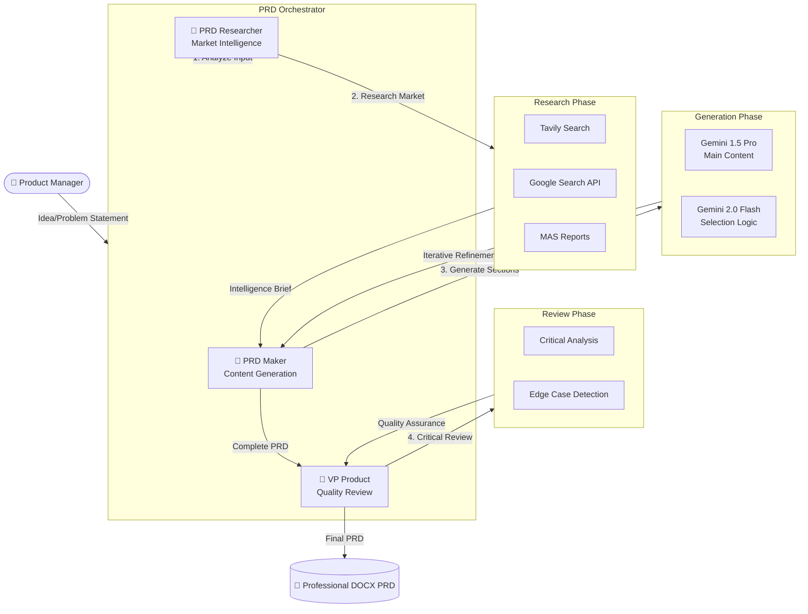

# STREAMINTEL (Project Specter)
## Product & Architecture Overview

Welcome to the non-technical master document for **STREAMINTEL**! This guide is written in plain English to help anyone—regardless of coding experience—understand exactly what this software does, how it is built, and how all the different pieces talk to each other.

---

## 1. Product Requirements Document (PRD)

### Executive Summary
Streamintel is an autonomous "ghost agent" that behaves like a digital researcher. Every day, it wakes up, searches the internet for new trends, features, and rumors regarding live streaming platforms (like Twitch, YouTube, and Kick), compiles a beautiful PDF intelligence report, and emails it directly to the team. 

It provides an interactive website (the Dashboard) where a team manager can remotely steer the agent's focus and manually trigger research scans at any time.

### Core Goals
- **Save Time:** Completely replace the need for human analysts to endlessly scroll social media to find streaming industry updates.
- **Deep Research:** Utilize "Retrieval-Augmented" AI to go beyond surface-level answers and stitch together weak signals into a coherent strategy report.
- **Set & Forget Operations:** The system must run flawlessly in the background, forever, for free, without needing a developer to constantly manage a server.
- **Distribution:** Automatically put the final PDF report directly into the hands of stakeholders via email.

### The Two Ways to Use Streamintel
1. **The Remote Dashboard (Streamlit Cloud):** A website where you can type in new search targets (e.g., "Find out what Kick is doing with monetization"), and hit a giant "Execute" button to force a scan right now. You can also type in comma-separated emails to instantly send the results to colleagues.
2. **The Automated Robot (GitHub Actions):** A silent background process running on GitHub servers. Every day (e.g., at 8:00 AM), it wakes up, reads the instructions you saved from the Dashboard, does the research, and automatically emails the daily summary to the team's mailing list.

---

## 2. Entity Relationship & Architecture Diagram (ERD)

This diagram tracks the flow of data through our entire ecosystem. It shows how the User (you) interacts with the website, and how the website relays instructions to the invisible background robot.

---

## 3. How the "Specter" Agent Actually Works

The brain of this application lives in `streamintel_agent.py`. It uses a methodology known in the AI world as **Retrieval-Augmented Generation (RAG) with Direct Prompting**.

**Here is the plain-English translation of that process:**

1. **The Wake Up:** The agent starts by receiving a list of "Target Vectors" (your keywords).
2. **The Hunt (Retrieval):** The agent does *not* immediately ask the AI to answer the underlying question. Instead, it uses **Tavily** (a specialized search engine built for AI). It says to Tavily, "Scrape the internet for the last 7 days regarding these keywords and give me the raw, messy text."
3. **The Assembly (Augmented):** The agent takes all this messy, raw internet data and wraps it into a giant box. 
4. **The Brain (Generation):** Finally, the agent calls **Google Gemini** (the actual Artificial Intelligence). It gives Gemini the giant box of raw data and says: 
   > *"You are Specter, a covert intelligence operative. Do not make anything up. Read all the messy text in this box, stitch it together into a clean, strategic breakdown focused on engagement and monetization, stamp it with today's date, and format it perfectly."*
5. **The Output:** Gemini returns a beautifully written, perfectly categorized Markdown (text) report.

By forcing the AI to only look at the box of fresh internet data we just gathered, we prevent the AI from "hallucinating" or making things up, and guarantee it only analyzes the absolute newest information on the internet!

---

## 4. PRD Maker: AI-Powered Product Requirements Document Generator

### Overview
The PRD Maker is a sophisticated multi-agent AI system that generates enterprise-grade Product Requirements Documents. It uses three specialized AI agents working in orchestration to create comprehensive, research-backed PRDs that meet Google/Meta-level standards.

### The Three-Agent Architecture

### Agent Roles & Backgrounds

#### 🤖 Agent 1: PRD Researcher
**Role:** Senior Competitive Intelligence Analyst  
**Background:** Former McKinsey consultant with 15+ years in tech market research  
**Responsibilities:**
- Classify input as idea, problem statement, or both
- Conduct comprehensive market research using Tavily + Google Search
- Analyze existing MAS reports for relevant insights
- Synthesize competitive intelligence and market data

#### 🎯 Agent 2: PRD Maker
**Role:** Senior Product Manager & Technical Writer  
**Background:** Former PM at Google and Meta with 12+ years writing PRDs for billion-user products  
**Responsibilities:**
- Generate 3 detailed options for each PRD section
- Use Gemini 2.0 Flash for intelligent option selection
- Ensure enterprise-grade quality and completeness
- Iterate through all standard PRD sections systematically

#### 👔 Agent 3: VP Product
**Role:** Vice President of Product Management  
**Background:** 20+ years as VP Product at Fortune 500 companies, $2B+ product portfolios  
**Responsibilities:**
- Critical executive review of complete PRD
- Identify missing requirements and edge cases
- Flag technical and business risks
- Add "Missed Cases" section with detailed Q&A analysis

### PRD Sections Generated
1. **Overview** - Executive summary and product vision
2. **Problem Statement** - Clear problem definition
3. **User Personas** - Target user profiles and needs
4. **North Star Metrics** - Key success measurements
5. **Functional Requirements** - What the product must do
6. **Non-Functional Requirements** - Quality attributes and constraints
7. **User Flow** - User journey and interaction design
8. **Technical Requirements** - Technical implementation details
9. **Edge Cases** - Boundary conditions and error scenarios
10. **Missed Cases** - Critical gaps identified by executive review

### Technical Implementation
- **Models:** Gemini 1.5 Pro (content generation), Gemini 2.0 Flash (selection logic)
- **Search:** Tavily API (primary), Google Custom Search API (supplemental)
- **Output:** Professional DOCX format with proper formatting
- **Integration:** MAS reports analysis for contextual intelligence
- **Quality Gates:** Multi-agent review ensures enterprise-grade output

### Usage in Streamlit Dashboard
The PRD Maker is accessible as the third tab ("📋 PRD Maker") in the main dashboard. Users simply:
1. Enter their idea or problem statement
2. Click "Generate PRD"
3. Wait for the multi-agent system to complete (2-3 minutes)
4. Download the professional DOCX document

This feature transforms MAS from a research tool into a complete product development platform, enabling rapid PRD generation backed by market intelligence and executive-level review.
